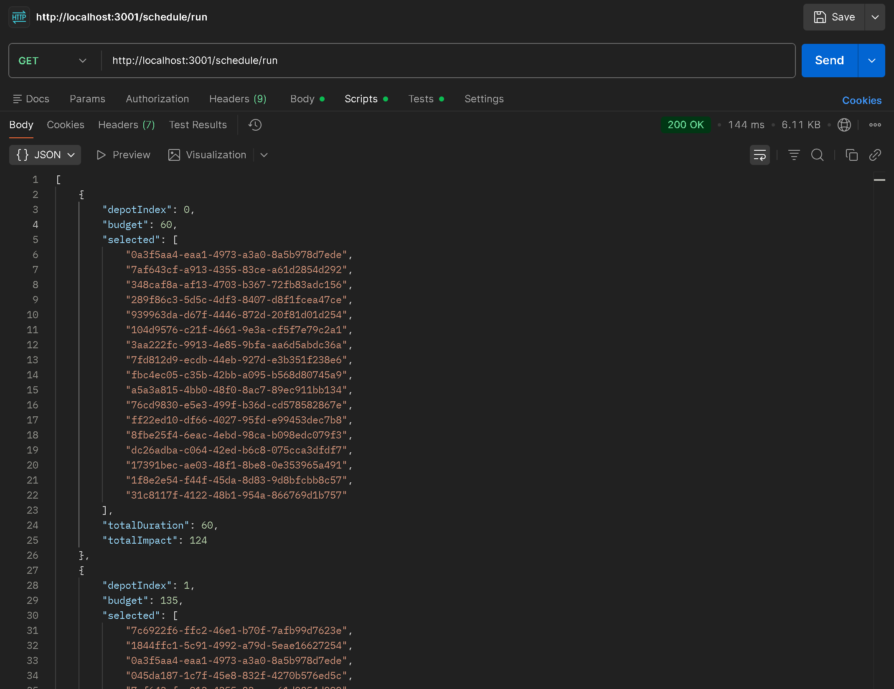
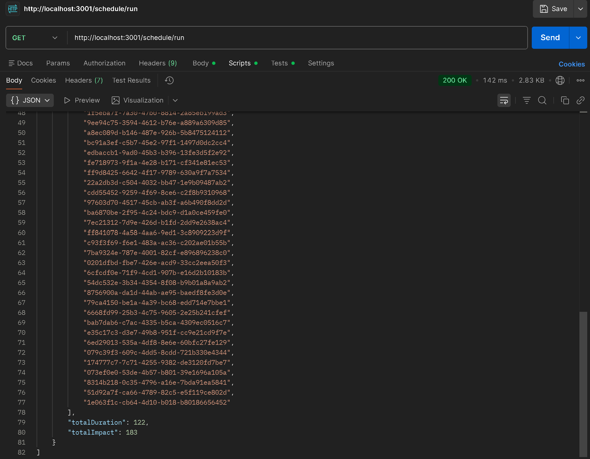
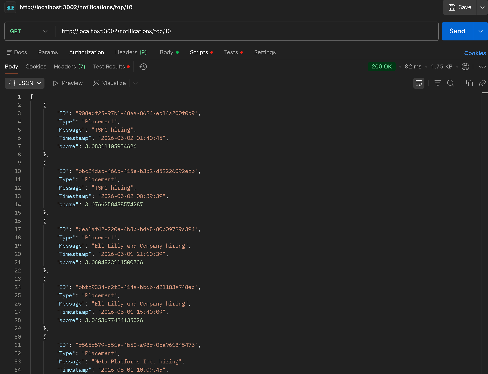
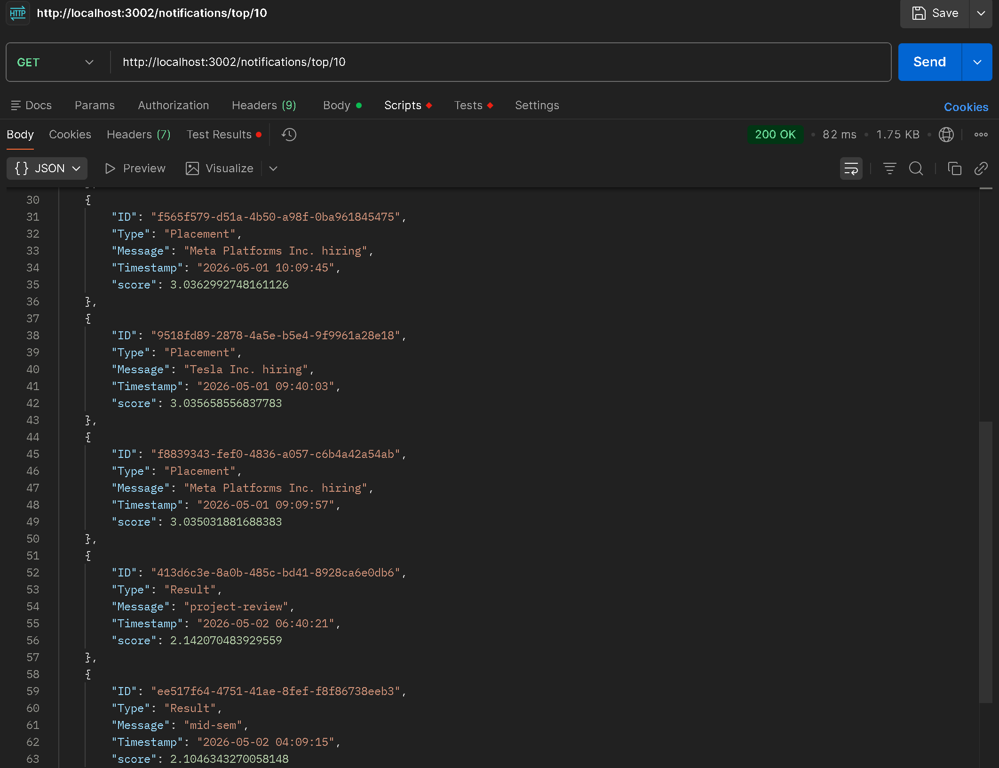
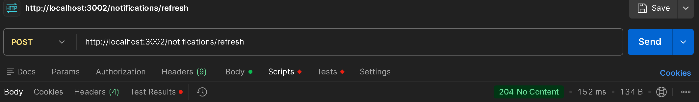

# RA2311003011703 — Backend Assessment

## Setup

Install everything in one shot:

```bash
npm run install-all
```

This covers the root, `logging_middleware/`, `vehicle_maintenance_scheduler/`, and `notification_app_be/`.

Next, copy `.env.example` to `.env` and set your `CLIENT_SECRET`:

```bash
cp .env.example .env
```

The app will crash at startup with a clear message if `CLIENT_SECRET` is missing — intentional, so you can't accidentally run without credentials.

## Project Layout

```
config.js                     — shared config, reads from .env
logging_middleware/
  tokenStore.js               — fetches and caches the auth token (60s buffer before expiry)
  logger.js                   — validates and sends logs to the external API
vehicle_maintenance_scheduler/
  scheduler.js                — knapsack DP + backtracking, plus API fetch helpers
  routes.js                   — three GET endpoints
  index.js                    — Express on port 3001
notification_app_be/
  store.js                    — in-memory notification cache, refreshed on demand
  inbox.js                    — min-heap implementation and priority scoring
  routes.js                   — three endpoints (list, top-N, refresh)
  index.js                    — Express on port 3002
notification_system_design.md — written design doc (Stages 1–6)
```

## Running

**Scheduler** (port 3001):
```bash
npm run start-scheduler
```

| Endpoint | What it does |
|---|---|
| `GET /schedule/run` | Runs knapsack for every depot, returns selected tasks + totals |
| `GET /schedule/depots` | Raw depot list from the API |
| `GET /schedule/vehicles` | Raw vehicle/task list from the API |

**Notifications** (port 3002):
```bash
npm run start-notifications
```

| Endpoint | What it does |
|---|---|
| `GET /notifications` | All cached notifications; add `?type=Placement` to filter |
| `GET /notifications/top/:n` | Top N by priority score, descending |
| `POST /notifications/refresh` | Refetches from the external API, returns 204 |

## How the scheduler works

Standard 0/1 knapsack with a bottom-up DP table. Each depot has a `MechanicHours` budget; the task list (vehicles) is shared across all depots. After filling the table, backtracking reconstructs which tasks were selected. Complexity is O(n × budget) per depot.

Tasks with missing or zero `Duration`/`Impact` fields are skipped silently (with a warn log) and don't affect the result.

## How the notification ranking works

Each notification gets a score: `typeWeight + recencyBonus`, where `typeWeight` is 3 for Placement, 2 for Result, 1 for Event, and `recencyBonus = 1 / (1 + hoursElapsed + 0.01)`.

The bonus is always below 1, so a newer low-priority notification can never beat an older high-priority one. A min-heap of size N keeps the top-N as notifications are processed — O(n log k) instead of a full sort.

## Notes

- Credentials come from `.env` — see `.env.example` for the keys required
- Token is cached in memory and refreshed 60 seconds before it expires, so repeated requests don't trigger extra auth calls
- All routes return a JSON error body on failure with the appropriate HTTP status code
- `getAll()` returns a copy of the internal array, so callers can't accidentally mutate the store

## Screenshots

### GET /schedule/run
<p align="center">
  
  &nbsp;&nbsp;
  
</p>

### GET /notifications/top/10
<p align="center">
  
  &nbsp;&nbsp;
  
</p>

### POST /notifications/refresh
<p align="center">
  
</p>